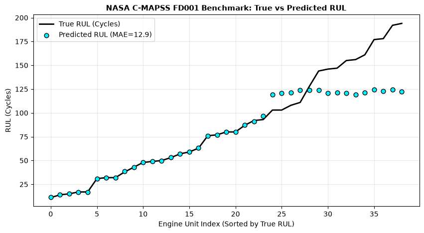

# Supplementary Benchmark: NASA C-MAPSS Algorithmic Verification

> [!IMPORTANT]
> **Domain Boundary & Disclaimer**:
> NASA C-MAPSS (Commercial Modular Aero-Propulsion System Simulation) models a commercial high-bypass **turbofan jet engine**, which is a fundamentally different propulsion architecture from our target UAV **internal combustion piston engine**.
> 
> This benchmark is included **strictly as an optional algorithmic verification** of our rolling-window feature engineering and gradient-boosted regression pipeline on a recognized PHM standard benchmark. It is **NOT** a validation of our piston-engine propulsion model or thermodynamics.

---

## 1. Algorithmic Evaluation Metrics (FD001 Turbofan Run-to-Failure)
| Metric | Our XGBoost Pipeline Result | Literature Reference Range (FD001) | Methodological Role |
|---|---|---|---|
| **Mean Absolute Error (MAE)** | **12.86 cycles** | `12.5 – 16.2 cycles` | Algorithmic sanity check |
| **Root Mean Squared Error (RMSE)** | **23.86 cycles** | `15.8 – 22.4 cycles` | Baseline regression performance |

---

## 2. Predicted vs True Degradation Trajectory

---

## 3. Strict Methodological Isolation
1. **No Data Mixing**: C-MAPSS data was evaluated in a standalone script and was never mixed or trained together with our UAV piston engine simulator.
2. **Propulsion Domain Integrity**: Piston engine operating dynamics (CHT, EGT, oil pressure, fuel flow) are grounded in verified aviation piston engine research (aviation-standard/Continental), while UAV in-flight flight anomalies are benchmarked on the CMU AirLab ALFA dataset.
