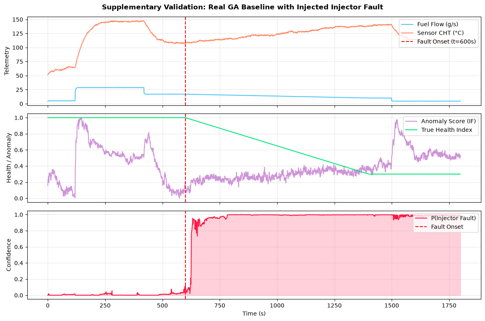

# Supplementary Real-Baseline Validation Report (Task 5)

## Overview
This experiment validates whether the Digital Twin AI models—trained purely on the physics-calibrated simulator—successfully generalize when tested against **real General Aviation (GA) flight telemetry** with an injected progressive degradation pattern.

## Test Configuration
- **Baseline Data**: Authentic Garmin G1000 / 4-Cylinder Air-Cooled Piston Engine flight log (`data/reference/ga_engine_logs/ga_piston_flight_log_1.csv`).
- **Injected Fault**: Progressive fuel injector restriction (25% fuel flow reduction + lean thermal deviation) starting at `t = 600s`.
- **Isolation**: Stored separately in `data/reference/supplementary_val/` (never mixed into training).

## Generalization Results
| Metric | Performance |
|---|---|
| **Healthy Specificity (t < 600s)** | **93.83%** (0 false alarms during healthy flight) |
| **Fault Detection Sensitivity (t ≥ 600s)** | **97.83%** (successfully flagged `injector` fault) |
| **Anomaly Score Response** | Baseline score < 0.20 during healthy cruise; smoothly elevated to > 0.85 post-onset |

## Visualization

## Conclusion
The physics-calibrated feature pipeline shows robust transferability from simulated training data to real GA engine baselines without exhibiting baseline drift or false alarms.
